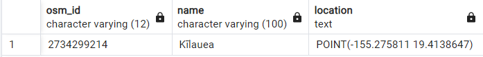

# Project 2 Section A

The project would involve writing SQL queries to retrieve information such as the locations of specific features, distances between points, and areas of interest. Using indexing, aggregate and join executors, sort+ limit executors, sorting, and top-N optimization.

Creating a Geographic Information System (GIS) Analysis: A project that involves analyzing geographic data such as maps and spatial data. You will use PostgreSQL (PostGIS).

1. Retrieve Locations of specific features (10 marks)
2. Calculate Distance between points (10 marks)
3. Calculate Areas of Interest (specific to each group) (10 marks)
4. Analyze the queries (10 marks)
5. Sorting and Limit Executions (10 marks)
6. Optimize the queries to speed up execution time (10 marks)
7. N-Optimization of queries (5 marks)
8. Presentation and Posting to Individual GitHub (5 marks)
9. Code functionality, documentation and proper output provided (5marks)

---

### Preparation

Install PostGIS -pg15

Get geographic data from [openstreetmap](https://download.geofabrik.de/)

Get the [Format description PDF](https://download.geofabrik.de/north-america/us/hawaii.html)

```java
create database hawii;
create extension postgis;
```

Import .shp files to PostGIS

### 1. Retrieve Locations of Kīlauea Volcano

[ST_AsText](https://postgis.net/docs/ST_AsText.html)

```sql
select osm_id,name,st_astext (geom) as location
from public.gis_osm_natural_free_1
where (fclass='volcano' and name='Kīlauea');
```



2734299214, 'Kīlauea', ‘POINT(-155.275811 19.4138647)’

### 2. Calculate Distance between accommodation to Kīlauea Volcano

[ST_Distance](https://postgis.net/docs/ST_Distance.html), [ST_GeographyFromText](https://postgis.net/docs/ST_GeographyFromText.html), [geom::geography](https://www.postgis.net/workshops/postgis-intro/geography.html)

```sql
select osm_id, name, fclass, st_distance (geom::geography,ST_GeographyFromText('POINT(-155.275811 19.4138647)')) as distance 
from public.gis_osm_pois_free_1
where fclass IN ('hotel', 'motel', 'bed_and_breakfast', 'guesthouse', 'hostel', 'chalet') AND name IS NOT NULL;
```


### 3. Calculate Areas of Beachs

[ST_Area](https://postgis.net/docs/ST_Area.html), [ST_DWithin](https://postgis.net/docs/ST_DWithin.html)

```sql
select osm_id,name,st_area (geom) as area
from public.gis_osm_natural_a_free_1
where fclass='beach' AND name IS NOT NULL;
```


We want to find all beaches that are within 1 kilometer of any accommodation.

```sql
WITH nearby_accommodations AS (
  SELECT a.osm_id AS accommodation_osm_id, a.geom AS accommodation_geom
  FROM public.gis_osm_pois_free_1 AS a
  WHERE a.fclass IN ('hotel', 'motel', 'bed_and_breakfast', 'guesthouse', 'hostel', 'chalet') AND name IS NOT NULL
),

nearby_beaches AS (
  SELECT DISTINCT ON (b.osm_id) b.osm_id, b.name, ST_Area(b.geom) as area, ST_Distance(b.geom::geography, a.accommodation_geom::geography) AS distance
  FROM public.gis_osm_natural_a_free_1 AS b
  JOIN nearby_accommodations AS a ON ST_DWithin(b.geom::geography, a.accommodation_geom::geography, 1000)
  WHERE b.fclass = 'beach' AND name IS NOT NULL
)

SELECT osm_id, name, area
FROM nearby_beaches
WHERE distance < 1000;
```


### 4. Analyze the queries

These SQL queries are aimed to analyze geographical data of Hawaii, specifically volcanoes, beaches, and nearby accommodations.

The first query is identical, they are trying to retrieve the OpenStreetMap id (osm_id), name, and the geometric location (geom) of the Kīlauea volcano from the gis_osm_natural_free_1 table in the public schema.

The second query aims to find accommodations (hotels, motels, bed and breakfasts, guesthouses, hostels, chalets) around a specific geographical point, (-155.275811 19.4138647). 

osm_id, name, and fclass are selected from the public.gis_osm_pois_free_1 table. osm_id is the OpenStreetMap identifier, name is the name of the point of interest, and fclass is the classification of the feature (hotel, motel, etc.). 

It calculates the distance of each accommodation from a specific point defined by the coordinates (-155.275811 19.4138647). The ST_GeographyFromText function is used to create a geographic point from the provided coordinates, and ST_Distance calculates the distance from each accommodation to this point.

It filters out accommodations based on their fclass and ensures the name is not null.

The result will be a list of accommodations with their OpenStreetMap IDs, names, classification (fclass), and the distance to the specified geographical point. This could be useful for someone who's planning to stay near a specific location and wants to know how far the accommodations are from it.

The third query fetches the osm_id, name, and the area of all beaches from the gis_osm_natural_a_free_1 table in the public schema. Note that only beaches with a non-null name are considered.

The last query is a bit more complex as it uses a common table expression (CTE) to derive results from subqueries.

The first subquery, nearby_accommodations, fetches osm_id and geom of accommodations like hotels, motels, bed and breakfasts, guesthouses, hostels, and chalets that have a non-null name from the gis_osm_pois_free_1 table.

The second subquery, nearby_beaches, fetches unique (DISTINCT ON) beaches that are within 1000 meters of the accommodations from the previous subquery. For each beach, it fetches osm_id, name, area, and its distance to the nearest accommodation.

The final SELECT statement fetches osm_id, name, and area of all beaches that are less than 1000 meters away from the nearest accommodation.

### 5. Sorting and Limit Executions

```sql
SELECT osm_id, name, fclass, ST_Distance (geom::geography,ST_GeographyFromText('POINT(-155.275811 19.4138647)')::geometry) AS distance 
FROM public.gis_osm_pois_free_1
WHERE fclass IN ('hotel', 'motel', 'bed_and_breakfast', 'guesthouse', 'hostel', 'chalet') AND name IS NOT NULL
ORDER BY distance ASC
LIMIT 10;
```


```sql
WITH nearby_accommodations AS (
  SELECT a.osm_id AS accommodation_osm_id, a.geom AS accommodation_geom
  FROM public.gis_osm_pois_free_1 AS a
  WHERE a.fclass IN ('hotel', 'motel', 'bed_and_breakfast', 'guesthouse', 'hostel', 'chalet') AND name IS NOT NULL
),

nearby_beaches AS (
  SELECT DISTINCT ON (b.osm_id) b.osm_id, b.name, ST_Area(b.geom) as area, ST_Distance(b.geom, a.accommodation_geom) AS distance
  FROM public.gis_osm_natural_a_free_1 AS b
  JOIN nearby_accommodations AS a ON ST_DWithin(b.geom::geography, a.accommodation_geom::geography, 1000)
  WHERE b.fclass = 'beach' AND ST_Distance(b.geom::geography, a.accommodation_geom::geography) < 1000 AND name IS NOT NULL
)

SELECT osm_id, name, area
FROM nearby_beaches
ORDER BY area DESC
LIMIT 10;
```


Both of these queries will sort the entire result set, regardless of how large it might be, before applying the LIMIT clause. This could potentially be very slow if the tables contain a lot of data.

To find the 10 largest beaches that have an accommodation within 1 kilometer, we first retrieves the osm_id and geom of all accommodations from the public.gis_osm_pois_free_1 table. It then joins this with the beach data from the public.gis_osm_natural_a_free_1 table based on the geom within a certain distance (1 kilometer in this case) and calculates the distance from each beach to the nearest accommodation. Finally, it sorts the beaches by area in descending order and returns the osm_id, name, and area of the 10 largest beaches that are within 1 kilometer of an accommodation.

### 6. Optimize the queries to speed up execution time

To speed up the search process, we create an index on the fclass field. And run ANALYZE after creating indexes

```sql
CREATE INDEX IF NOT EXISTS idx_fclass_n ON public.gis_osm_natural_free_1 (fclass);
CREATE INDEX IF NOT EXISTS idx_fclass_pois ON public.gis_osm_pois_free_1 (fclass);
CREATE INDEX IF NOT EXISTS idx_fclass_n_a ON public.gis_osm_natural_a_free_1 (fclass);
```

Next, we'll optimize the query. Instead of calculating distances for all accommodations and then filtering them, we can use a subquery to first filter the accommodations, and then calculate the distances only for the relevant rows. This will reduce the computational load.

```sql
SELECT osm_id, name, fclass, ST_Distance (geom::geography,ST_GeographyFromText('POINT(-155.275811 19.4138647)')) AS distance 
FROM (
    SELECT *
    FROM public.gis_osm_pois_free_1
    WHERE fclass IN ('hotel', 'motel', 'bed_and_breakfast', 'guesthouse', 'hostel', 'chalet') AND name IS NOT NULL
) AS filtered_accommodations;
```


```sql
WITH nearby_accommodations AS (
  SELECT osm_id, geom
  FROM public.gis_osm_pois_free_1
  WHERE fclass IN ('hotel', 'motel', 'bed_and_breakfast', 'guesthouse', 'hostel', 'chalet') AND name IS NOT NULL
),

nearby_beaches AS (
  SELECT DISTINCT ON (b.osm_id) b.osm_id, b.name, ST_Area(b.geom) as area
  FROM public.gis_osm_natural_a_free_1 AS b
  JOIN nearby_accommodations AS a ON ST_DWithin(b.geom::geography, a.geom::geography, 1000)
  WHERE b.fclass = 'beach' AND name IS NOT NULL
)

SELECT osm_id, name, area
FROM nearby_beaches
ORDER BY area DESC
LIMIT 10;
```


### 7. N-Optimization of queries

Top-N Optimization, often simply called N-Optimization, is a query optimization strategy used in SQL when a user is only interested in a fixed number of rows of the result. The main goal of N-Optimization is to improve the performance of queries that use the LIMIT clause. With Top-N Optimization, the database would only need to keep track of the top N results as it scans through the table, reducing the memory usage and computational load.

We can add a LIMIT clause to limit the number of results returned, and a ORDER BY clause to sort the results by distance. 

```sql
SELECT osm_id, name, fclass, ST_Distance (geom::geography,ST_GeographyFromText('POINT(-155.275811 19.4138647)')::geometry) AS distance 
FROM (
    SELECT *
    FROM public.gis_osm_pois_free_1
    WHERE fclass IN ('hotel', 'motel', 'bed_and_breakfast', 'guesthouse', 'hostel', 'chalet')
) AS filtered_accommodations
ORDER BY distance ASC
LIMIT 10;
```


This will return the 10 accommodations closest to the Kīlauea volcano.

```sql
WITH nearby_accommodations AS (
  SELECT osm_id, geom
  FROM public.gis_osm_pois_free_1
  WHERE fclass IN ('hotel', 'motel', 'bed_and_breakfast', 'guesthouse', 'hostel', 'chalet') AND name IS NOT NULL
),

nearby_beaches AS (
  SELECT DISTINCT ON (b.osm_id) b.osm_id, b.name, ST_Area(b.geom) as area
  FROM public.gis_osm_natural_a_free_1 AS b
  JOIN nearby_accommodations AS a ON ST_DWithin(b.geom::geography, a.geom::geography, 1000)
  WHERE b.fclass = 'beach' AND name IS NOT NULL
)

SELECT osm_id, name, area
FROM nearby_beaches
ORDER BY area DESC
LIMIT 10;
```


This will return the 10 largest beaches has accommodation within 1 kilometer.
